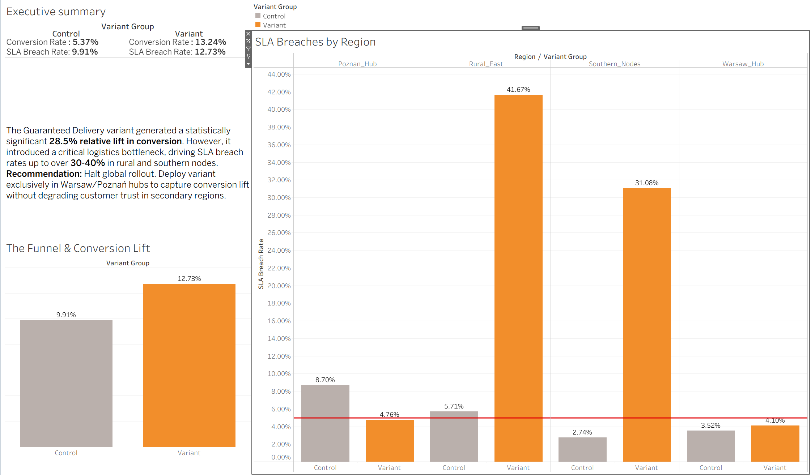

# Optimizing Checkout: The Impact of Guaranteed Delivery Dates on Logistics

**[Live Interactive Dashboard](https://public.tableau.com/app/profile/lana.v1040/viz/AB_dashboard/Dashboard?publish=yes)**

##  Project Overview
This project evaluates an A/B test designed to test the impact of displaying guaranteed delivery dates on product detail pages. While the primary goal was to increase conversion rates, the critical secondary objective was to measure the stress this feature placed on the backend logistics network. 

**Tools Used:** Google Colab (Python), Google BigQuery (SQL), Tableau

## Data Architecture & Core Logic
To simulate a realistic marketplace environment, I generated a synthetic dataset representing 10,000 user sessions, their subsequent orders, and the backend delivery performance. 

Instead of relying on fragmented data pulls, I built a core query in BigQuery to handle user sessionization, prevent sample ratio mismatch (SRM) by filtering out dual-exposed users, and aggregate the metrics. 

*(View the full aggregation logic in `sql/data_aggregation.sql`)*

## Statistical Evaluation
I conducted the statistical analysis using Python (`notebooks/StatEvaluation.ipynb`) to ensure the results were valid before making a business recommendation.

* **Traffic Split:** 50/50 (SRM Check Passed: $p = 0.1285$)
* **Control Conversion Rate:** 9.91%
* **Variant Conversion Rate:** 12.73%
* **Statistical Significance:** The variant produced a 28.5% relative lift in conversion ($p < 0.001$).

## The Operational Bottleneck (Guardrail Metrics)
While the frontend conversion metrics looked like a massive success, joining the operational data revealed a critical flaw. The increase in order volume caused the logistics network to fail to meet the promised delivery dates, particularly in secondary regions.

* **Global SLA Breach Rate (Control):** 5.37%
* **Global SLA Breach Rate (Variant):** 13.24%

## Final Business Recommendation
1. **Halt Global Rollout:** Do not deploy the guaranteed delivery feature to all users. The logistics network in the Rural East and Southern nodes cannot currently support the increased demand, resulting in SLA breach rates over 30%.
2. **Phased Regional Deployment:** Deploy the variant exclusively to users serviced by the Warsaw and Poznań hubs, where SLA breach rates remained under our 5% acceptable threshold, allowing us to capture the conversion lift without degrading customer trust.
